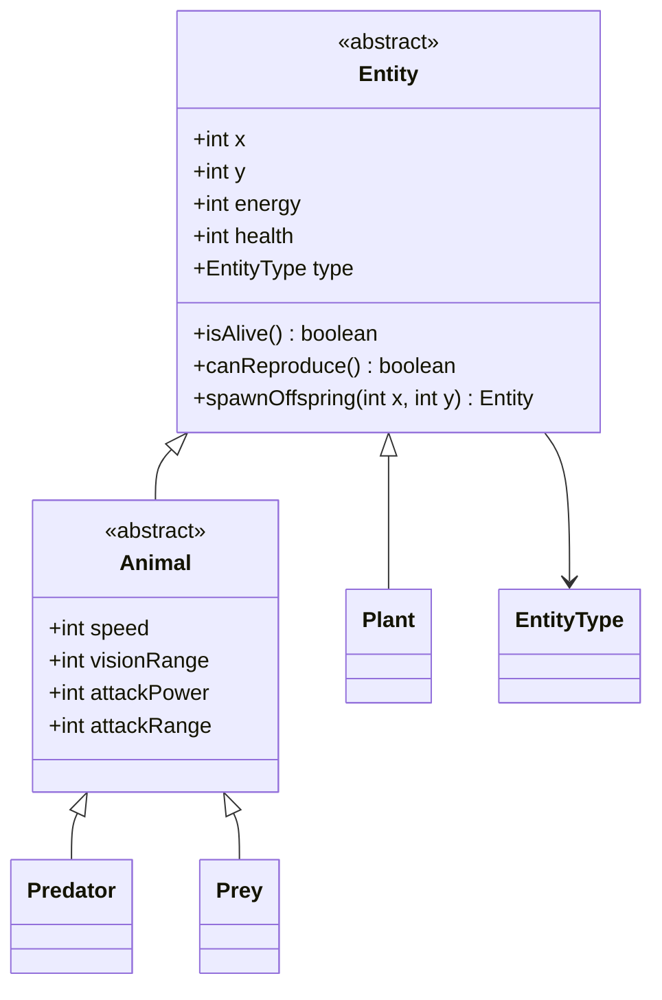
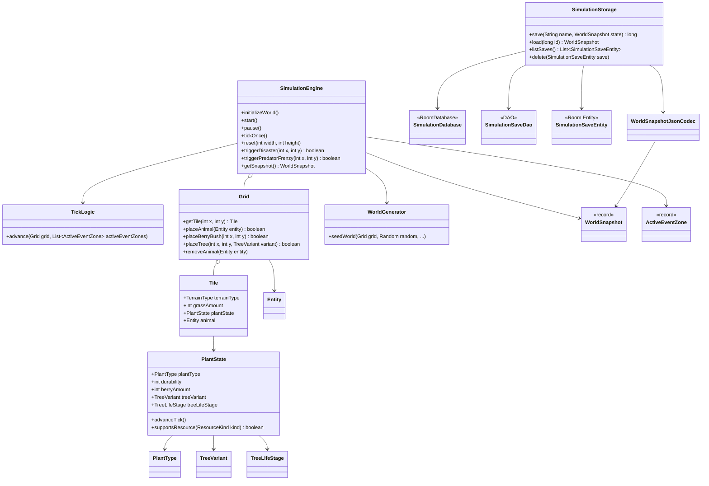
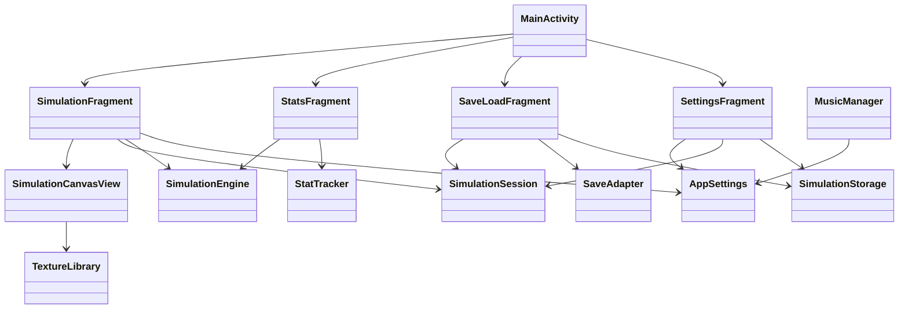

# Final Documentation

## Project

- Course: Object-Oriented Programming (CT60A4001)
- Project: Tleilax
- Team: Maksym Oliinyk, Maia Salin, Ejota Elezaj
- Platform: Android, Java 21, Min SDK 28, Target SDK 36
- Repository: https://github.com/oliynykmax/Tleilax
- Video: No public video link. Demo video is provided only in the final course submission channel.

## Implementation Summary

Tleilax is a real-time 2D ecosystem sandbox. The world is represented as a layered grid (`terrain`, `ground`, `plant`, `animal`). The user can run/pause the simulation, change speed, place entities during a live run, trigger live events, inspect statistics, and save/load world states.

Main implementation areas:

- Simulation core: tick-based behavior for predators, prey, and plants.
- Rendering: pan/zoom canvas that draws only the visible viewport.
- Persistence: Room-backed save/load with serialized snapshots.
- Statistics: live charting and summary metrics.
- Settings: presentation options and world-generation defaults.

## UML (Implemented Architecture)

The following diagrams describe the delivered implementation rather than the original plan.

### Domain Model



### Simulation Core And Persistence



### UI And Data Flow



These diagrams match the delivered implementation at package level:

- `com.example.tleilax.model`
- `com.example.tleilax.simulation`
- `com.example.tleilax.storage`
- `com.example.tleilax.ui`
- `com.example.tleilax.utils`

## Application Use-Flow

1. Open the app and go to Simulation.
2. If needed, open Settings and adjust world-generation defaults (grass coverage and start counts).
3. Start or resume simulation from the play button.
4. Place entities by selecting species from the top row and tapping the canvas.
5. Trigger live events from event controls between species row and canvas.
6. Inspect statistics in Stats tab.
7. Save or load snapshots in Save/Load tab.
8. Reset or full cleanup from Simulation/Settings when needed.

## Installation / Run

Prerequisites:

- Android Studio (current stable)
- Android SDK configured
- Java 21 toolchain

Commands:

```bash
./gradlew assembleDebug
./gradlew installDebug
```

Testing:

```bash
./gradlew testDebugUnitTest
```

## Team Composition And Work Sharing

- Maia Salin: statistics implementation and UI/UX work.
- Ejota Elezaj: entity class design and class relationships.
- Maksym Oliinyk: save/load feature implementation and rendering engine.
- Shared work: remaining features were implemented collaboratively after the initial split, with pairing-programming style integration and refinement.

Development process:

- The team used a protected `main` branch and pull request workflow during the main development phase.
- GitHub Issues were used to track remaining tasks and progress.
- Development decisions were documented continuously in `book/src/development-decisions.md`.

## Tools Used

- Android Studio
- Gradle
- Room
- MPAndroidChart
- GitHub (repository and issue tracking)
- GitHub Actions (CI build artifact)

## Bonus Features (Implemented / Not Implemented)

This section is included explicitly for grading.

| Feature | Status | Notes | Where in app / code | Points |
|---|---|---|---|---|
| RecyclerView | Implemented | Save/Load list uses RecyclerView | Save/Load tab; `SaveLoadFragment`, `SaveAdapter` | +1 |
| Species Images | Implemented | Distinct species sprites on canvas | Simulation tab; `SimulationCanvasView`, `TextureLibrary` | +1 |
| Simulation Visualization | Implemented | Real-time canvas updates with pan/zoom | Simulation tab; `SimulationCanvasView`, `SimulationFragment` | +2 |
| Tactical Combat | Implemented | User intervention via tap-to-place and live event controls | `SimulationFragment`, `SimulationEngine.triggerDisaster`, `SimulationEngine.triggerPredatorFrenzy` | +2 |
| Statistics | Implemented | Per-tick population tracking | Stats tab; `StatsFragment`, `StatTracker` | +1 |
| Statistics Visualization | Implemented | MPAndroidChart line graph | Stats tab; `StatsFragment` | +2 |
| Specialization Bonuses | Implemented | Species-specific speed/vision/energy/attack traits | `EntityType`, `TickLogic` | +2 |
| Randomness | Implemented | Randomized movement and reproduction probability are implemented; mutation was de-scoped | `TickLogic` (movement + reproduction chance) | +1 |
| Fragments | Implemented | Simulation / Stats / Save-Load / Settings | `SimulationFragment`, `StatsFragment`, `SaveLoadFragment`, `SettingsFragment` | +2 |
| Data Storage & Loading | Implemented | Room-backed saves and restore | Save/Load tab; `SimulationStorage`, `SimulationSaveDao`, `SimulationSaveEntity` | +2 |
| Custom Feature X | Implemented | Live environmental events (Disaster, Predator Frenzy) | `SimulationEngine`, `ActiveEventZone`, `SimulationCanvasView` | +2 |

Total bonus points implemented: **18**

## Scope Changes During Development

- World size remains fixed at `256x256` (documented scope decision).
- Mutation feature was de-scoped and not delivered in final implementation.
- Statistics chart library switched from AnyChart plan to MPAndroidChart for native Android integration.

See `book/src/development-decisions.md` for detailed decision history.

## AI Usage Disclaimer

AI assistance was used during development for:

- debugging issues encountered during implementation,
- code review support and refactoring checks,
- searching technical information and alternatives (for example evaluating and replacing AnyChart with MPAndroidChart).

Final implementation decisions, code integration, and acceptance of changes were performed by the project team.
