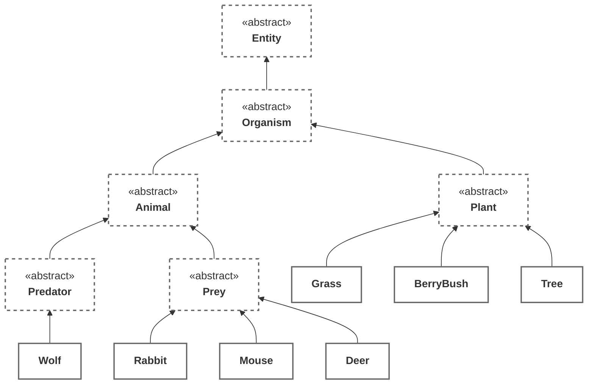
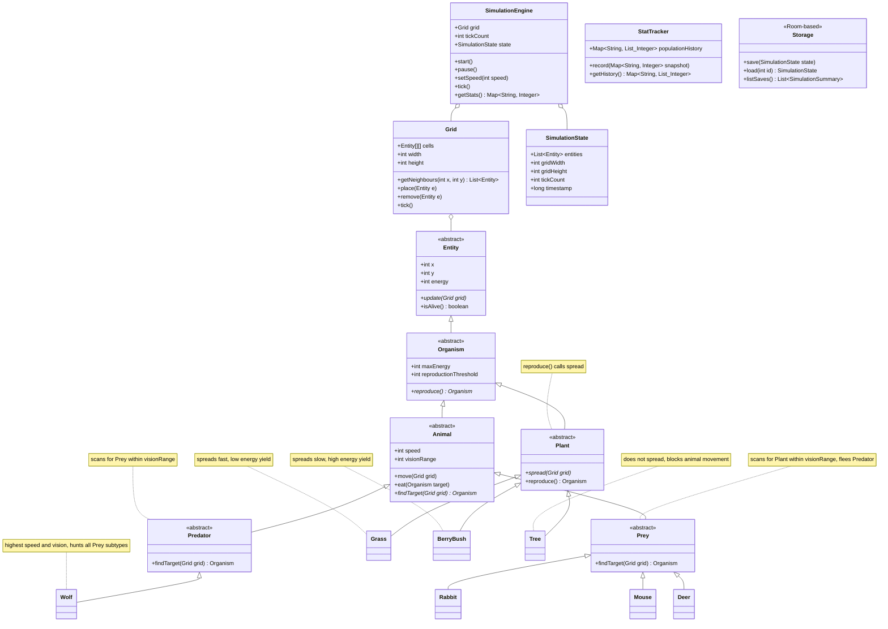
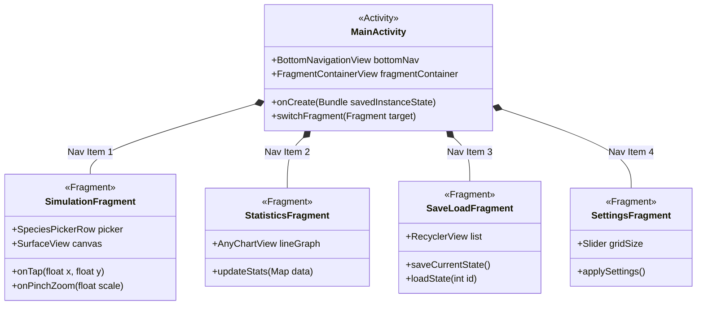
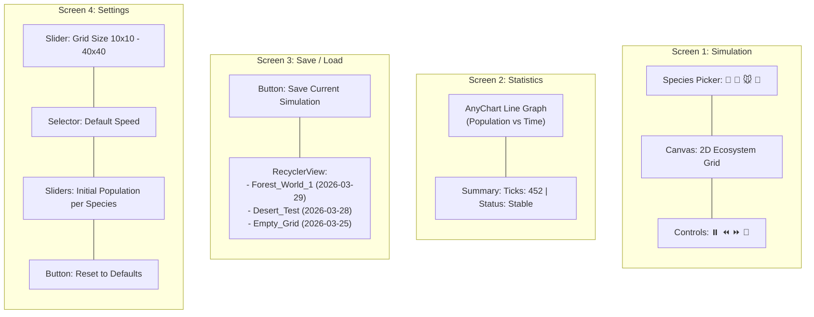

# Project Plan — Tleilax
**OOP Course — CT60A4001**
**Team:** Maksym Oliinyk, Maia Salin, Ejota Elezaj

---

## 1. Topic & Overview

Tleilax is a real-time 2D ecosystem sandbox simulation for Android. The user configures a
starting world — choosing species and their initial populations — then observes the simulation
evolve autonomously on a top-down grid canvas. Predators hunt, prey flee, plants spread and
are consumed. No outcome is scripted; complex population dynamics emerge naturally from
simple per-entity behavioral rules.

The user can intervene during a running simulation by tapping the canvas to place new
entities, adjust simulation speed, or pause at any point. Population statistics are tracked live
and visualized as graphs on a separate screen. Simulations can be saved and reloaded.

---

## 2. Features

### Core (mandatory)
- Real-time tick-based simulation on a 2D grid
- Three species categories: Predator, Prey, Plant — up to 7 species total
- Per-entity behavior: movement, feeding, reproduction, energy/death
- Pre-simulation configuration (species counts, grid size)
- Tap-to-place entities during a live simulation
- Simulation speed control (pause, slow, normal, fast)
- Pinch-to-pan and pinch-to-zoom on the canvas

### Bonus features targeted
| Feature | Implementation | Points |
|---|---|---|
| RecyclerView | Save/load screen lists saved simulations | +1 |
| Species Images | Unique sprite per species drawn on canvas | +1 |
| Simulation Visualization | Animated canvas with live grid updates | +2 |
| Tactical Combat | User intervenes with tap-to-place and environmental events during live sim | +2 |
| Statistics | Live population count per species per tick | +1 |
| Statistics Visualization | AnyChart line graph, updates in real time | +2 |
| Specialization Bonuses | Each species has unique speed, vision, energy rules | +2 |
| Randomness | Movement direction, reproduction chance, mutation | +1 |
| Fragments | Simulation / Stats / Save-Load / Settings screens | +2 |
| Data Storage & Loading | Room database, save and restore full simulation state | +2 |
| Custom Feature X | Environmental Events — drought, food bloom, predator frenzy | +2 |
| **Total available** | | **+18** |

---

## 3. Species & Inheritance Hierarchy

**Key behavioral differences per class:**

| Species | Speed | Vision | Energy | Special Rule |
|---|---|---|---|---|
| Wolf | High | High | High | Hunts Deer, Rabbit, Mouse |
| Rabbit | Medium | Medium | Low | Eats Grass, BerryBush |
| Mouse | High | Low | Low | Eats Grass, BerryBush |
| Deer | Low | Medium | Medium | Eats Grass, BerryBush, Tree leaves |
| Grass | — | — | — | Spreads to adjacent empty tiles |
| BerryBush | — | — | — | Slower spread, higher energy yield |
| Tree | — | — | — | Does not spread, blocks movement |

---

## 4. Preliminary UML Class Diagram

### Classes and relationships

---

## 5. UI Description

### 5.1 View Architecture

### 5.2 Visual Wireframes

The app uses a single `MainActivity` hosting a `FragmentContainerView`. Navigation is
handled via a bottom navigation bar with four destinations.

---

### Screen 1 — Simulation (Main Screen)

**Layout:**
- Top: Horizontal species picker (button row) — one button per species, tap to select active species
- Center: Full-width `SurfaceView` / `Canvas` — renders the 2D grid, entities drawn as sprites
  - Tap on canvas → places selected species at that tile
  - Two-finger pinch → zoom in/out
  - Two-finger drag → pan the camera across the grid
- Bottom bar: Pause / Play, Speed Down, Speed Up, Reset buttons

---

### Screen 2 — Statistics

**Layout:**
- AnyChart line graph — one line per species, X axis = ticks, Y axis = population count
- Updates in real time while simulation runs in background
- Summary card below: current tick, species alive/extinct

---

### Screen 3 — Save / Load

**Layout:**
- RecyclerView listing saved simulations (name, date, tick count, species alive)
- Swipe to delete, tap to load
- Save current simulation button at top

---

### Screen 4 — Settings

**Layout:**
- Grid size slider (10×10 to 40×40)
- Default simulation speed selector
- Initial population sliders per species (used when starting a new simulation)
- Reset to defaults button

---

## 6. Technology Stack

| Item | Choice |
|---|---|
| Language | Java 21 |
| Build | Gradle (Groovy DSL) |
| Min SDK | 28 |
| Target SDK | 36 |
| Persistence | Room |
| Charts | AnyChart-Android |
| Architecture | Single Activity + Fragments, no MVVM |

---

## 7. Planned Bonus Features Summary

RecyclerView, Species Images, Simulation Visualization, Tactical Combat (user intervention),
Statistics, Statistics Visualization, Specialization Bonuses, Randomness, Fragments,
Data Storage & Loading, Custom Feature X (Environmental Events).

Total targeted bonus: **+18 points** (minimum needed for grade 5: +12, buffer: +6)
